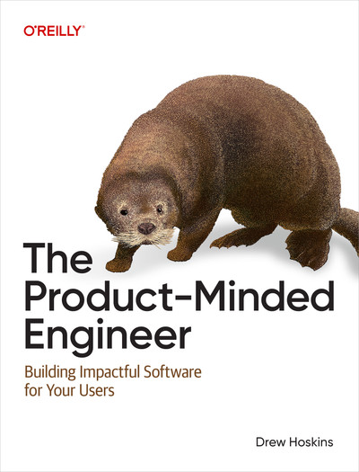

# 产品思维工程师 - 中文翻译版

**作者**： [Drew Hoskins](https://drewhoskins.substack.com/)，[《The Product-Minded Engineer》](https://learning.oreilly.com/library/view/the-product-minded-engineer/9781098173722/)：曾就职于 Microsoft、Meta、Stripe，现为 Temporal Technologies 产品经理。在产品设计、ORM 设计、API 设计、VR 服务等领域拥有丰富经验。

**译者**：[冯若航](https://vonng.com) / [Vonng](https://github.com/Vonng) (rh@vonng.com) [Pigsty](https://pgsty.com) 创始人，[活跃](https://committers.top/china)[开源贡献者](https://gitstar-ranking.com/Vonng)，PostgreSQL Hacker。开源 RDS PG 发行版 [Pigsty](https://pigsty.cc/zh/) 与公众号《[老冯云数](https://mp.weixin.qq.com/s/p4Ys10ZdEDAuqNAiRmcnIQ)》作者，[数据库老司机](https://pigsty.cc/zh/blog/db)，[云计算泥石流](https://pigsty.cc/zh/blog/cloud)，曾于阿里，苹果，探探担任架构师与DBA。

**阅读**：访问 [https://tpme.vonng.com](https://tpme.vonng.com) 阅读本书在线版本，或使用 [hugo](https://gohugo.io/documentation/) / [hextra](https://imfing.github.io/hextra/zh-cn/) 主题自行构建。

---------

## 译序

> 不懂产品的工程师做不出好软件
>
> —— 冯若航 / Vonng

软件工程师往往精于系统思维，却疏于产品思维。我们擅长把东西做对（do things right），却不一定知道做什么是对的（do the right thing）。

本书作者 Drew Hoskins 在微软、Meta、Stripe 等公司摸爬滚打多年，提炼出一套将产品思维融入工程实践的方法论。从场景构建到用户研究，从交互设计到产品架构，本书为工程师提供了一个系统性的框架：如何像产品经理一样思考，同时保持工程师的严谨与深度。

这本书的核心理念是：最好的工程师不仅能构建系统，还能构建用户真正需要的产品。产品思维不是产品经理的专属技能，而是每个工程师都应该掌握的核心能力。理解用户、定义问题、设计方案、验证假设——这些能力能让你写出的每一行代码都更有价值。

翻译本书，既是学习产品思维的过程，也是对自身工程实践的一次审视。希望这份译文能帮助更多中文世界的工程师，在技术精进之外，培养出更强的产品直觉。

---------

## 前言

> 海獭是一种生活在海洋与陆地边界的生物。产品思维工程师也是如此——他们生活在系统与用户的边界上，既能深入技术的海洋，也能走上用户体验的陆地。

---------

## 目录

* [序言](https://tpme.vonng.com/preface)
* [第一部分：开发与打磨](https://tpme.vonng.com/part-i)
  - [第一章：产品思维基础](https://tpme.vonng.com/ch1) - 场景作为产品思维的基本单元
  - [第二章：引导用户使用你的产品](https://tpme.vonng.com/ch2) - 示能性、意符与用户旅程设计
* [第二部分：交付](https://tpme.vonng.com/part-ii)
  - [第三章：错误与警告](https://tpme.vonng.com/ch3) - 诊断信息设计与错误处理
  - [第四章：体验你自己的产品](https://tpme.vonng.com/ch4) - 吃自己的狗粮：内部用户测试方法
  - [第五章：持续倾听用户](https://tpme.vonng.com/ch5) - 持续部署、反馈收集与 A/B 测试
* [第三部分：探索](https://tpme.vonng.com/part-iii)
  - [第六章：理解你的目标受众](https://tpme.vonng.com/ch6) - 用户画像、认知偏差与用户研究
  - [第七章：通过模拟发现你的产品](https://tpme.vonng.com/ch7) - 用户场景、产品简报、需求文档与用户旅程
* [第四部分：定义](https://tpme.vonng.com/part-iv)
  - [第八章：交互设计](https://tpme.vonng.com/ch08) - 示能性与意符的设计与迭代
  - [第九章：产品架构](https://tpme.vonng.com/ch09) - 非功能性需求与产品架构设计
* [索引](https://tpme.vonng.com/indexes)
* [后记](https://tpme.vonng.com/colophon)

---------

## 法律声明

译者纯粹出于 **学习目的** 与 **个人兴趣** 翻译本书，不追求任何经济利益。

译者保留对此版本译文的署名权，其他权利以原作者和出版社的主张为准。

本译文只供学习研究参考之用，不得公开发行或用于商业用途。有能力阅读英文书籍者请购买正版支持，本书英文原版可在 [O'Reilly](https://learning.oreilly.com/library/view/the-product-minded-engineer/9781098173722/) 平台上阅读。

---------

## LICENSE

[CC-BY 4.0](LICENSE)
